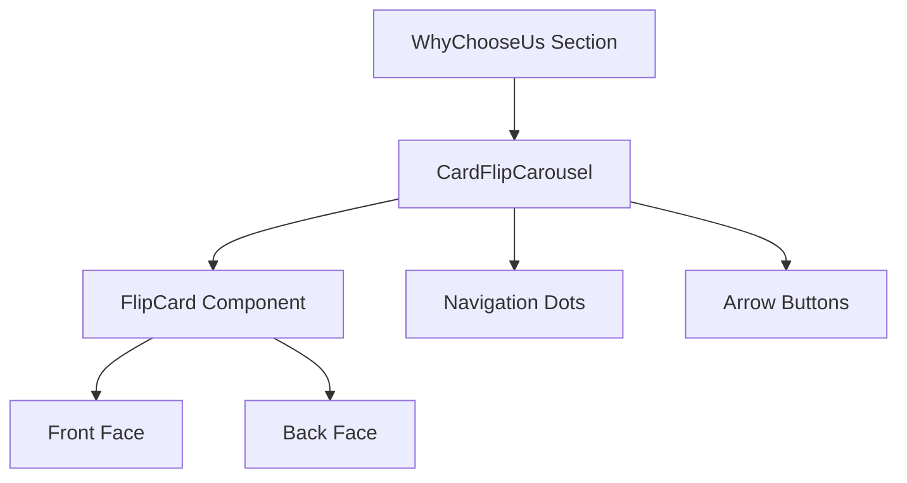
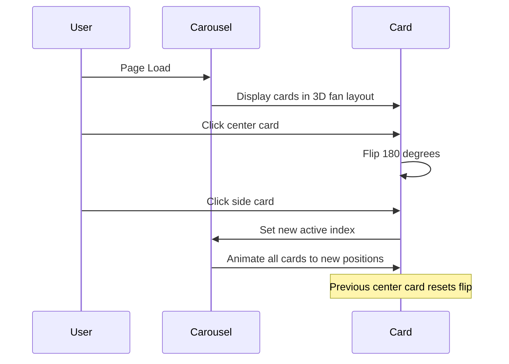

# CardFlipCarousel Integration Plan

## Overview
Replace the existing AnimatedCardCarousel component with a new CardFlipCarousel that features 3D fan layout, card flip animations, and interactive navigation.

## Current State Analysis

### Existing Components
- [`WhyChooseUs.tsx`](app/src/sections/WhyChooseUs.tsx) - Section component that displays the "Why SocioSports" content
- [`AnimatedCardCarousel/index.tsx`](app/src/components/AnimatedCardCarousel/index.tsx) - Current carousel with hover-based fan-out animation
- [`AnimatedCardCarousel/Card.tsx`](app/src/components/AnimatedCardCarousel/Card.tsx) - Individual card component
- [`AnimatedCardCarousel/cardData.ts`](app/src/components/AnimatedCardCarousel/cardData.ts) - Card data with icons and gradients

### Current Behavior
- Auto-rotating cards every 3 seconds
- Hover triggers a 2x2 grid fan-out layout
- Uses Framer Motion for animations
- Cards show icons, titles, and descriptions

## Target Design

### New CardFlipCarousel Features
1. **3D Fan Layout** - Side cards angle away with `rotateY` + `translateZ` recession
2. **Click to Flip** - Center card flips 180° revealing back face
3. **Click Side Card** - Smoothly animates to center position
4. **Navigation** - Dot indicators + arrow buttons
5. **Visual Effects** - Orange glow border on active card, muted borders on inactive

### Card Data Structure
```typescript
interface CardData {
  id: number;
  frontImage: string;    // Image path for card front
  frontLabel: string;    // Label badge text
  backTitle: string;     // Title on card back
  backBody: string;      // Description on card back
  accent: string;        // Accent color (#ff4d1c or #ff6b35)
}
```

## Implementation Plan

### Step 1: Create CardFlipCarousel Component
Create new file: `app/src/components/CardFlipCarousel.tsx`

**Key Implementation Details:**
- Use `useState` for active index and flip state
- Use inline styles for 3D transforms (perspective, rotateY, translateZ)
- CSS transitions for smooth animations
- `backfaceVisibility: hidden` for proper card flip

**3D Positioning Calculations:**
```javascript
const offset = index - activeIndex;
const rotateY = offset * 18;           // Fan spread degrees
const translateX = offset * 160;       // Horizontal spread
const translateZ = -Math.abs(offset) * 80;  // Depth recession
const scale = index === activeIndex ? 1 : 0.88 - Math.abs(offset) * 0.04;
const opacity = Math.abs(offset) > 2 ? 0 : 1 - Math.abs(offset) * 0.15;
```

### Step 2: Map Existing Images to Cards
Use images from `app/public/images/`:

| Card | Front Image | Theme |
|------|-------------|-------|
| Athlete Network | `/images/athlete_story_feature.png` | Connect athletes nationwide |
| Digital Identity | `/images/sports_profile_mockup.png` | Verified sports profile |
| Tournaments | `/images/tournament_discovery.png` | Competition platform |
| Discover | `/images/about_vision.png` | India's sports revolution |

### Step 3: Update WhyChooseUs Section
Modify [`WhyChooseUs.tsx`](app/src/sections/WhyChooseUs.tsx:88):
- Replace `AnimatedCardCarousel` import with `CardFlipCarousel`
- Keep existing GSAP scroll animations
- Maintain the left content area with "Our Mission" header

### Step 4: Styling Integration
- Dark theme: `#0a0a0a` background
- Accent color: `#ff4d1c` (orange)
- Secondary accent: `#ff6b35`
- Border: Active card gets orange glow, inactive gets `rgba(255,255,255,0.08)`

## File Changes Summary

### New Files
- `app/src/components/CardFlipCarousel.tsx` - Main carousel component

### Modified Files
- `app/src/sections/WhyChooseUs.tsx` - Update import statement

### Optional Cleanup
- Remove `app/src/components/AnimatedCardCarousel/` directory if no longer needed

## Component Architecture



## Animation Flow



## Technical Considerations

### Performance
- Use CSS transforms for GPU acceleration
- Avoid layout thrashing with `will-change` property
- Use `transform-style: preserve-3d` for 3D context

### Accessibility
- Add `aria-label` to navigation buttons
- Add `role="button"` to clickable cards
- Keyboard navigation support (arrow keys)

### Responsive Design
- Scale down card size on mobile devices
- Adjust translateX/translateZ values for smaller screens
- Consider single card view on very small screens

## Acceptance Criteria
- [x] 3D fan layout displays correctly with side cards angled
- [x] Clicking center card flips it to show back face
- [x] Clicking side card smoothly transitions it to center
- [x] Navigation dots update correctly
- [x] Arrow buttons navigate between cards
- [x] Orange glow border on active card
- [x] Dark theme maintained
- [x] Existing images used for card fronts
- [x] Smooth animations with no jank

## Next Steps
1. Switch to Code mode to implement the CardFlipCarousel component
2. Update the WhyChooseUs section to use the new component
3. Test the implementation in the browser
