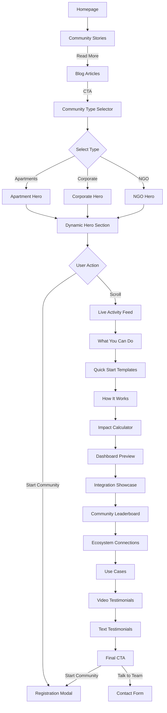
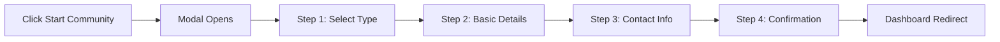
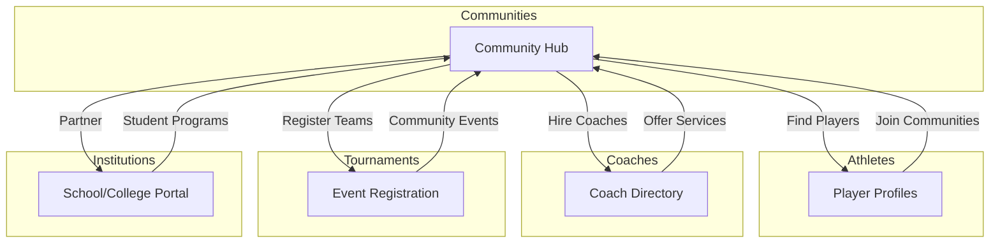

# Communities Page Transformation Plan

## Executive Summary

The current Communities page feels like an **emotional campaign** rather than a **product module**. Users don't understand what action to take. This plan transforms it into a clear, actionable ecosystem module that answers:
- Who is this for?
- What problem does it solve?
- What can I do here?
- What action should I take?

### Client Decisions
- **Community Types Priority**: Apartments, Corporate, NGOs (in that order)
- **Registration Flow**: Modal-based registration (not separate page)
- **Additional Features**: Added below (see Enhanced Features section)

---

## Current State Analysis

### Existing Files
- [`CommunityPage.tsx`](app/src/pages/CommunityPage.tsx) - Simple wrapper with 2 sections
- [`CommunityVibe.tsx`](app/src/sections/CommunityVibe.tsx) - 451 lines of emotional storytelling
- [`DigitalWellness.tsx`](app/src/sections/DigitalWellness.tsx) - 270 lines about digital fatigue

### Current Issues
1. **Hero is emotional, not actionable** - "Sports aren't just about winning. It's about belonging." is powerful but lacks clear CTA
2. **No clear product features** - User doesn't know what they can DO
3. **Campaign-style content** - Digital fatigue, movement is medicine = blog content, not product page
4. **Missing ecosystem connection** - Doesn't show how Communities integrates with Athletes, Coaches, Tournaments, etc.
5. **No use cases** - Missing real-world examples of community building

---

## Enhanced Features (Client Requested Additions)

### 1. Community Type Selector (NEW)
Interactive filter at the top of the page allowing users to select their community type:
- **Apartments & Gated Communities** (Priority 1)
- **Corporate & Companies** (Priority 2)
- **NGOs & Youth Programs** (Priority 3)
- **Schools & Colleges** (Priority 4)
- **Clubs & Associations** (Priority 5)

Each selection dynamically updates:
- Hero messaging
- Feature cards relevance
- Use cases shown
- Testimonials displayed

### 2. Live Community Activity Feed (NEW)
Real-time feed showing:
- New communities created
- Upcoming events
- Recent tournament results
- Member achievements
- Activity map showing hotspots

### 3. Community Impact Calculator (NEW)
Interactive tool showing potential ROI:
- Input: Community size, sport type, frequency
- Output: Projected engagement, health benefits, cost savings
- Comparison with industry benchmarks

### 4. Quick Start Templates (NEW)
Pre-built templates for common community types:
- Weekend Cricket League Template
- Corporate Fitness Challenge Template
- Apartment Sports Day Template
- NGO Youth Program Template

### 5. Community Health Dashboard Preview (NEW)
Visual preview of analytics dashboard:
- Member engagement graphs
- Event attendance trends
- Growth metrics
- Participation heatmaps

### 6. Integration Showcase (NEW)
Show integrations with:
- WhatsApp for notifications
- Google Calendar for events
- Payment gateways for fees
- Social media sharing

### 7. Community Leaderboard (NEW)
Gamification element:
- Top communities by engagement
- Most active organizers
- Rising communities
- Sport-specific rankings

### 8. Success Stories Video Section (NEW)
Embedded video testimonials:
- 30-60 second clips from community organizers
- Before/After transformation stories
- Tips from successful community builders

---

## Transformation Architecture

### New Page Structure

```
CommunityPage.tsx (Redesigned)
├── CommunityTypeSelector.tsx (NEW - Filter by community type)
├── CommunitiesHero.tsx (NEW - Dynamic hero based on selection)
├── LiveActivityFeed.tsx (NEW - Real-time community activity)
├── WhatYouCanDo.tsx (NEW - Feature cards)
├── QuickStartTemplates.tsx (NEW - Pre-built templates)
├── HowItWorks.tsx (NEW - Simple 3-step process)
├── ImpactCalculator.tsx (NEW - ROI calculator)
├── CommunitiesEcosystem.tsx (NEW - Ecosystem connections)
├── CommunityUseCases.tsx (NEW - Real-world examples)
├── DashboardPreview.tsx (NEW - Analytics preview)
├── IntegrationShowcase.tsx (NEW - WhatsApp, Calendar, Payments)
├── CommunityLeaderboard.tsx (NEW - Gamification)
├── VideoTestimonials.tsx (NEW - Video success stories)
├── CommunityTestimonials.tsx (NEW - Social proof)
├── CommunitiesCTA.tsx (NEW - Final call-to-action with modal)
└── SimpleFooter.tsx (Existing)
```

### Modal Components
```
CommunityRegistrationModal.tsx (NEW - Multi-step registration)
├── Step 1: Community Type Selection
├── Step 2: Basic Details (Name, Location, Sport)
├── Step 3: Contact Information
└── Step 4: Confirmation & Next Steps
```

### Blog Migration
```
Emotional Content → Blog Articles
├── "Why Sports Reduce Digital Addiction"
├── "Building Stronger Communities Through Play"
├── "How Local Sports Improve Mental Health"
└── "Movement is Medicine: The Science"
```

### Homepage Integration
```
HomePage.tsx (Updated)
├── ... existing sections ...
├── CommunityStories.tsx (NEW - Blog highlights)
└── SimpleFooter.tsx
```

---

## Detailed Section Specifications (Enhanced)

### 0. CommunityTypeSelector.tsx (NEW - Priority Feature)

**Purpose**: Allow users to filter content by their community type.

**Community Types (Priority Order)**:
1. **Apartments & Gated Communities** - "Manage your residential sports facilities"
2. **Corporate & Companies** - "Build employee wellness through sports"
3. **NGOs & Youth Programs** - "Create impact through sports initiatives"
4. **Schools & Colleges** - "Digitize your institution's sports programs"
5. **Clubs & Associations** - "Grow your sports club membership"

**Design**:
- Horizontal pill-style selector below navigation
- Active state with accent color
- Smooth content transition on selection
- Persists selection in localStorage

---

### 1. CommunitiesHero.tsx (Enhanced with Dynamic Content)

**Purpose**: Clear, action-oriented hero that immediately tells users what they can do.

**Dynamic Content by Community Type**:

| Type | Headline | Subtext |
|------|----------|---------|
| Apartments | "Transform Your Apartment Into a Sports Hub" | "Organize weekend leagues, manage facility bookings, and build a healthier community." |
| Corporate | "Elevate Employee Wellness Through Sports" | "Boost productivity, reduce healthcare costs, and build team spirit with corporate sports programs." |
| NGOs | "Create Lasting Impact Through Sports" | "Track youth development, measure outcomes, and showcase your program's success." |
| Schools | "Digitize Your School's Sports Programs" | "From PT classes to inter-school tournaments, manage everything in one platform." |
| Clubs | "Grow Your Sports Club Membership" | "Attract members, organize events, and manage your club efficiently." |

**CTAs**:
- Primary: "Start a Community" → Opens modal
- Secondary: "See How It Works" → Scroll to HowItWorks

**Trust Indicators** (Dynamic):
- "500+ Active Communities"
- "50,000+ Members"
- "14+ Cities"
- "4.8★ Rating"

---

### 2. LiveActivityFeed.tsx (NEW - Engagement Feature)

**Purpose**: Show real-time activity to create FOMO and demonstrate platform activity.

**Feed Items**:
```
🏆 My Home Vihanga won their weekend cricket league
👥 Tech Mahindra Hyderabad just joined with 200+ employees
📅 Marathon Morning Run scheduled for tomorrow in Gachibowli
🎯 15 new members joined Brigade Gateway Community
📊 Kondapur Youth Club reached 100 members milestone
```

**Design**:
- Horizontal scrolling ticker or vertical feed
- Auto-refresh every 30 seconds
- Activity type icons (trophy, users, calendar, etc.)
- Location badges
- Click to expand details

---

### 3. WhatYouCanDo.tsx (Enhanced with Type-Specific Features)

**Purpose**: Show 4 clear feature cards explaining product capabilities.

**Feature Cards by Community Type**:

**Apartments**:
| Icon | Title | Description |
|------|-------|-------------|
| Home | Manage Facilities | Book courts, grounds, and equipment for residents |
| Users | Organize Leagues | Create weekend tournaments with automatic scheduling |
| Bell | Send Notifications | WhatsApp and email alerts for events and bookings |
| BarChart | Track Usage | Analytics on facility utilization and participation |

**Corporate**:
| Icon | Title | Description |
|------|-------|-------------|
| Building | Employee Teams | Create inter-department teams and leagues |
| Heart | Wellness Programs | Track employee fitness goals and activities |
| Calendar | Event Management | Schedule sports days and team-building events |
| Award | Recognition | Leaderboards and awards for active participants |

**NGOs**:
| Icon | Title | Description |
|------|-------|-------------|
| Users | Youth Registration | Easy onboarding for program participants |
| Target | Progress Tracking | Monitor individual and group development |
| FileText | Impact Reports | Generate reports for donors and stakeholders |
| MapPin | Multi-location | Manage programs across different centers |

---

### 4. QuickStartTemplates.tsx (NEW - Conversion Feature)

**Purpose**: Reduce friction by providing ready-to-use templates.

**Templates**:

| Template | Description | Includes |
|----------|-------------|----------|
| Weekend Cricket League | Complete tournament setup | Teams, schedule, scoring, leaderboard |
| Corporate Fitness Challenge | 30-day wellness program | Daily activities, tracking, rewards |
| Apartment Sports Day | Annual event template | Events, registration, volunteers |
| NGO Youth Program | 3-month development plan | Sessions, attendance, progress reports |
| Morning Run Club | Weekly activity template | Routes, timing, attendance |

**Design**:
- Card grid with preview images
- "Use Template" button
- Estimated setup time
- Success metrics from similar communities

---

### 5. ImpactCalculator.tsx (NEW - ROI Feature)

**Purpose**: Show potential value to encourage sign-up.

**Calculator Inputs**:
- Community type (dropdown)
- Number of members (slider: 10-1000+)
- Sports interest (multi-select)
- Current engagement level (low/medium/high)

**Calculator Outputs**:
```
Projected Impact for Your Community:

📊 Engagement: +340% increase expected
💰 Cost Savings: ₹2.4L/year in coordination time
❤️ Health Benefits: 85% of members more active
🏆 Events: 24+ tournaments/year potential

Based on data from 500+ similar communities
```

**Design**:
- Interactive sliders and dropdowns
- Real-time calculation updates
- Comparison with benchmarks
- "Get This Result" CTA

---

### 6. DashboardPreview.tsx (NEW - Product Preview)

**Purpose**: Show the analytics dashboard users will get access to.

**Preview Elements**:
- Member engagement graph (animated)
- Event attendance trends
- Growth chart
- Participation heatmap
- Top performers list

**Design**:
- Mock dashboard UI
- Animated data points
- "See Your Dashboard" CTA
- Hover for details

---

### 7. IntegrationShowcase.tsx (NEW - Technical Feature)

**Purpose**: Show how the platform integrates with existing tools.

**Integrations**:

| Integration | Use Case | Status |
|-------------|----------|--------|
| WhatsApp | Event notifications, reminders | ✅ Available |
| Google Calendar | Sync events automatically | ✅ Available |
| Razorpay | Collect fees and payments | ✅ Available |
| Social Media | Share events and results | ✅ Available |
| Email | Newsletters and updates | ✅ Available |

**Design**:
- Integration logos
- Brief description
- "Connect" button preview
- Setup time estimate

---

### 8. CommunityLeaderboard.tsx (NEW - Gamification)

**Purpose**: Create competition and aspiration among communities.

**Leaderboard Categories**:
- Most Active Communities (by events)
- Fastest Growing (new members)
- Highest Engagement (participation rate)
- Top Organizers (individual recognition)

**Design**:
- Tabbed leaderboard
- Community badges
- Rank change indicators
- "Challenge This Community" button

---

### 9. VideoTestimonials.tsx (NEW - Social Proof)

**Purpose**: Video testimonials for stronger emotional connection.

**Video Structure**:
- 30-60 second clips
- Before/After format
- Specific metrics mentioned
- Organizer tips

**Sample Videos**:
- "How Hiranandani Apartments 10x'd Their Sports Participation"
- "Tech Mahindra's Corporate Wellness Success Story"
- "From 10 to 200 Members: A Community Organizer's Journey"

**Design**:
- Video thumbnail grid
- Play button overlay
- Duration badge
- View count

---

## Detailed Section Specifications

### 1. CommunitiesHero.tsx (NEW)

**Purpose**: Clear, action-oriented hero that immediately tells users what they can do.

**Content Structure**:
```
Badge: "For Communities"
Headline: "Build Active, Engaged Sports Communities"
Subtext: "Organize local leagues, connect members, host events, and create a healthier sports culture in your area."
Primary CTA: "Start a Community" → Opens registration modal
Secondary CTA: "Explore Communities" → Scroll to discovery section
Trust Indicators: "500+ Active Communities | 50,000+ Members | 14+ Cities"
```

**Visual Elements**:
- Background: Subtle gradient with community sports imagery
- Hero image: Diverse group playing sports together
- Animated stats counter

**Key Differences from Current**:
- Action verbs: "Build", "Organize", "Connect", "Host"
- Clear CTAs instead of emotional quote
- Trust metrics prominently displayed

---

### 2. WhatYouCanDo.tsx (NEW)

**Purpose**: Show 4 clear feature cards explaining product capabilities.

**Feature Cards**:

| Icon | Title | Description | Metric |
|------|-------|-------------|--------|
| Users | Create Local Sports Groups | Build and manage sports groups for your apartment, company, or locality | 500+ Groups |
| Trophy | Host Community Tournaments | Organize tournaments with registration, brackets, and live scoring | 1,200+ Events |
| BarChart3 | Track Participation | Monitor engagement, attendance, and growth analytics | 50K+ Participants |
| MapPin | Discover Nearby Events | Find and join sports activities happening around you | 14+ Cities |

**Design**:
- 4-column grid on desktop, 2x2 on tablet, stacked on mobile
- Each card has icon, title, description, and stat
- Hover effects with ecosystem connection hints
- GSAP scroll-triggered animations

---

### 3. HowItWorks.tsx (NEW)

**Purpose**: Simple 3-step process showing how to get started.

**Steps**:
```
Step 1: Create Your Community
        ↓
Step 2: Invite Members & Set Up Events
        ↓
Step 3: Play, Track & Grow Together
```

**Visual Design**:
- Horizontal timeline with connecting lines
- Each step has icon, title, description
- Animated progression on scroll
- "Get Started" CTA at the end

---

### 4. CommunitiesEcosystem.tsx (NEW)

**Purpose**: Show how Communities connects to the broader SocioSports ecosystem.

**Ecosystem Connections**:
```
                    ┌─────────────┐
                    │  Athletes   │
                    └──────┬──────┘
                           │
┌─────────────┐    ┌───────┴───────┐    ┌─────────────┐
│   Coaches   │────│  COMMUNITIES  │────│ Tournaments │
└─────────────┘    └───────┬───────┘    └─────────────┘
                           │
                    ┌──────┴──────┐
                    │ Institutions│
                    └─────────────┘
```

**Content**:
- "Powered by SocioSports Ecosystem" badge
- Interactive connection diagram
- Each connection shows specific benefit:
  - Athletes: "Find local players to join your community"
  - Coaches: "Connect with certified trainers for your events"
  - Tournaments: "Seamlessly register for competitions"
  - Institutions: "Partner with schools and academies"

---

### 5. CommunityUseCases.tsx (NEW)

**Purpose**: Real-world examples showing impact.

**Use Cases**:

| Use Case | Before | After | Impact |
|----------|--------|-------|--------|
| Gated Community Weekend League | 10 players, irregular games | 150+ members, weekly tournaments | 15x growth |
| Corporate Sports Day | Once-a-year event | Monthly inter-department leagues | 12x engagement |
| Apartment Cricket Tournament | Ad-hoc WhatsApp groups | Organized platform with scoring | 200+ participants |
| NGO Youth Program | Manual tracking | Digital profiles & progress | 85% retention |

**Design**:
- Before/After comparison cards
- Real numbers and metrics
- Testimonial quotes from organizers
- Filter by community type

---

### 6. CommunityTestimonials.tsx (NEW)

**Purpose**: Social proof from real community organizers.

**Testimonial Structure**:
```
Photo | Name | Role | Community Type
Quote: "..."
Highlights: [Metric 1] [Metric 2] [Metric 3]
```

**Sample Testimonials**:
- Priya Sharma, Community Head, Hiranandani Apartments
- Rajesh Kumar, Sports Coordinator, Tech Mahindra
- Coach Venkatesh, Founder, Warangal Youth Sports

---

### 7. CommunitiesCTA.tsx (NEW)

**Purpose**: Strong closing call-to-action.

**Content**:
```
Headline: "Ready to Build Your Sports Community?"
Subtext: "Join thousands of communities already thriving on SocioSports"

Primary CTA: "Start Your Community" → Registration Modal
Secondary CTA: "Talk to Our Team" → Contact Form

Trust Elements:
- "Free to start"
- "No credit card required"
- "Setup in 5 minutes"
```

---

## Blog Migration Strategy

### Content to Migrate

| Current Section | Blog Article Title | Key Points |
|-----------------|-------------------|------------|
| Digital Wellness - Attention Crisis | "Why Sports Reduce Digital Addiction" | 8 sec attention span, dopamine loops, physical activity benefits |
| Digital Wellness - Movement is Medicine | "How Local Sports Improve Mental Health" | Mental health benefits, stress relief, community connection |
| CommunityVibe - Belonging | "Building Stronger Communities Through Play" | Social connection, belonging, age-inclusive sports |
| Digital Wellness - The Choice | "Movement is Medicine: The Science" | Physical benefits, chronic disease prevention |

### Blog Article Structure
Each blog will include:
- Hero image from existing assets
- 1,500-2,000 words
- Data points and statistics
- Call-to-action linking back to Communities page
- Author attribution
- Related articles section

---

## Homepage Integration

### New Section: CommunityStories.tsx

**Location**: After CorePrinciples, before Ecosystem

**Content**:
```
Section Title: "From Our Community Stories"
Layout: 3 featured blog cards in a row

Card 1: "Why Sports Reduce Digital Addiction"
Card 2: "Building Stronger Communities Through Play"  
Card 3: "How Local Sports Improve Mental Health"

CTA: "Read More Stories" → Blog page
```

**Design**:
- Compact card design with image, title, excerpt
- Category badges
- Read time indicator
- Hover animations

---

## Technical Implementation

### New Files to Create
```
app/src/sections/
├── CommunityTypeSelector.tsx (Priority filter - NEW)
├── CommunitiesHero.tsx (Dynamic hero - NEW)
├── LiveActivityFeed.tsx (Real-time activity - NEW)
├── WhatYouCanDo.tsx (Feature cards - NEW)
├── QuickStartTemplates.tsx (Pre-built templates - NEW)
├── HowItWorks.tsx (3-step process - NEW)
├── ImpactCalculator.tsx (ROI calculator - NEW)
├── CommunitiesEcosystem.tsx (Ecosystem connections - NEW)
├── CommunityUseCases.tsx (Real-world examples - NEW)
├── DashboardPreview.tsx (Analytics preview - NEW)
├── IntegrationShowcase.tsx (WhatsApp, Calendar, etc. - NEW)
├── CommunityLeaderboard.tsx (Gamification - NEW)
├── VideoTestimonials.tsx (Video stories - NEW)
├── CommunityTestimonials.tsx (Text testimonials - NEW)
├── CommunitiesCTA.tsx (Final CTA with modal trigger - NEW)
└── CommunityStories.tsx (for homepage - NEW)

app/src/components/
├── CommunityRegistrationModal.tsx (Multi-step modal - NEW)
└── CommunityTypeContext.tsx (Context for type selection - NEW)
```

### Files to Modify
```
app/src/pages/CommunityPage.tsx - Complete rewrite with all new sections
app/src/pages/HomePage.tsx - Add CommunityStories section
app/src/App.tsx - Ensure routing is correct
```

### Files to Deprecate (Keep for Blog Content Reference)
```
app/src/sections/CommunityVibe.tsx - Content migrated to blogs
app/src/sections/DigitalWellness.tsx - Content migrated to blogs
```

### State Management
```
CommunityTypeContext.tsx
├── selectedType: 'apartments' | 'corporate' | 'ngo' | 'school' | 'club'
├── setSelectedType: function
└── Dynamic content loading based on type
```

---

## Visual Design Guidelines

### Color Palette
- Primary: `var(--accent-orange)` - CTAs, highlights
- Secondary: `var(--accent-magenta)` - Accents
- Background: `var(--bg-primary)`, `var(--bg-secondary)`
- Text: `var(--text-primary)`, `var(--text-secondary)`

### Typography
- Headlines: Font-black, uppercase, tracking-tight
- Subheads: Font-bold, tracking-wide
- Body: Font-medium, relaxed leading

### Animation
- GSAP ScrollTrigger for reveal animations
- Stagger effects for card grids
- Smooth hover transitions
- Counter animations for stats

---

## SEO Considerations

### Meta Tags
```
Title: "Build Sports Communities | Organize Local Leagues | SocioSports"
Description: "Create and manage sports communities, organize local tournaments, and connect with athletes. Join 500+ active communities across India."
Keywords: "sports community, local sports groups, community tournaments, sports organizing"
```

### Structured Data
- Organization schema for SocioSports
- LocalBusiness schema for communities
- Event schema for tournaments

---

## Success Metrics

### User Understanding
- Time on page increase
- Reduced bounce rate
- CTA click-through rate

### Engagement
- Community registrations
- Event creations
- Member invitations

### Content Performance
- Blog article reads
- Social shares
- Return visits

---

## Implementation Phases

### Phase 1: Core Infrastructure
1. Create CommunityTypeContext.tsx (State management)
2. Create CommunityTypeSelector.tsx (Priority filter)
3. Create CommunityRegistrationModal.tsx (Multi-step modal)
4. Create CommunitiesHero.tsx (Dynamic hero)

### Phase 2: Feature Sections
1. Create LiveActivityFeed.tsx (Real-time activity)
2. Create WhatYouCanDo.tsx (Feature cards)
3. Create QuickStartTemplates.tsx (Pre-built templates)
4. Create HowItWorks.tsx (3-step process)

### Phase 3: Engagement Tools
1. Create ImpactCalculator.tsx (ROI calculator)
2. Create DashboardPreview.tsx (Analytics preview)
3. Create IntegrationShowcase.tsx (WhatsApp, Calendar, etc.)
4. Create CommunityLeaderboard.tsx (Gamification)

### Phase 4: Social Proof
1. Create CommunitiesEcosystem.tsx (Ecosystem connections)
2. Create CommunityUseCases.tsx (Real-world examples)
3. Create VideoTestimonials.tsx (Video stories)
4. Create CommunityTestimonials.tsx (Text testimonials)

### Phase 5: CTA & Integration
1. Create CommunitiesCTA.tsx (Final CTA)
2. Update CommunityPage.tsx with all sections
3. Create CommunityStories.tsx for homepage
4. Update HomePage.tsx

### Phase 6: Blog Migration
1. Create blog articles from emotional content
2. Update routing and navigation
3. Test all flows

### Phase 7: Polish & Testing
1. GSAP animations
2. Responsive design testing
3. Performance optimization
4. Accessibility audit

---

## Mermaid Diagram: New Page Flow



---

## Mermaid Diagram: Registration Modal Flow



---

## Mermaid Diagram: Ecosystem Integration



---

## Comparison: Before vs After

| Aspect | Before | After |
|--------|--------|-------|
| Hero | Emotional quote | Action-oriented with CTAs |
| Purpose | Campaign feel | Product module |
| User Action | Unclear | Start/Explore Communities |
| Features | Hidden in text | 4 clear feature cards |
| Ecosystem | Not mentioned | Prominently shown |
| Use Cases | None | 4 real-world examples |
| Social Proof | Minimal | Dedicated testimonials section |
| Blog Content | Mixed in page | Separate articles with homepage highlights |

---

## Questions for Client Review

1. **Community Types**: Should we prioritize certain community types (apartments, corporate, NGOs) over others?

2. **Registration Flow**: Should "Start a Community" open a modal or navigate to a separate registration page?

3. **Blog Timing**: Should blog articles be created before or after the page transformation?

4. **Existing Content**: Should we completely remove CommunityVibe and DigitalWellness sections, or keep them in a reduced form?

5. **Homepage Priority**: Where exactly should CommunityStories appear on the homepage?

---

## Next Steps

1. **Client Approval**: Review this plan and provide feedback
2. **Design Mockups**: Create visual designs for new sections
3. **Content Writing**: Prepare blog articles from emotional content
4. **Development**: Implement new components in Code mode
5. **Testing**: Verify all flows and responsive design
6. **Launch**: Deploy changes and monitor metrics
