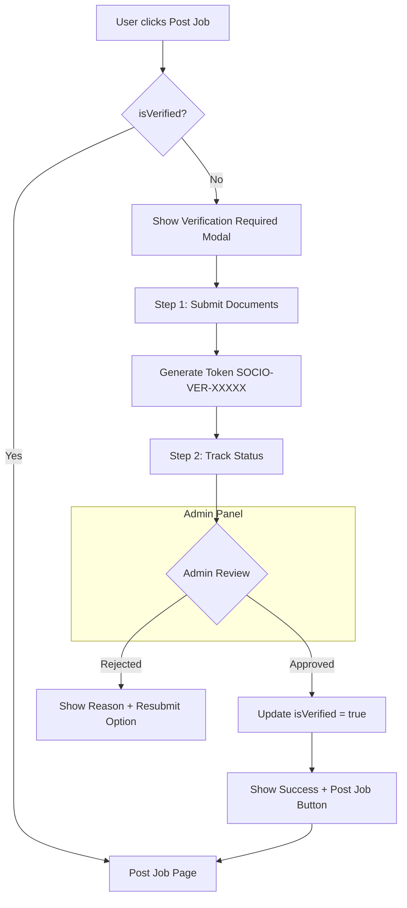

# Employer Verification System - Complete Architecture Plan

## Overview

This document outlines the complete architecture for implementing an Employer Verification System that requires users to complete verification before they can post jobs on the SocioSports platform.

---

## 1. System Architecture Overview



---

## 2. Database Schema Changes

### 2.1 Update User Model

Add verification fields to existing User model in `server/prisma/schema.prisma`:

```prisma
model User {
  // ... existing fields ...
  isVerified        Boolean   @default(false)  // Employer verification status
  verificationToken String?   @unique          // Current active verification token
  verificationStatus String?  @default("PENDING") // PENDING, UNDER_REVIEW, APPROVED, REJECTED
  employerVerification EmployerVerification?
}
```

### 2.2 New EmployerVerification Model

```prisma
model EmployerVerification {
  id          String   @id @default(uuid())
  userId      String   @unique
  user        User     @relation(fields: [userId], references: [id], onDelete: Cascade)
  
  // Documents - URLs to uploaded files
  companyRegistrationUrl String?  // Company Registration Certificate
  gstCertificateUrl      String?  // GST Certificate if applicable
  idProofUrl             String?  // ID Proof of authorized person
  organizationEmail      String?  // Official email
  contactNumber          String?  // Contact number
  
  // Verification Details
  token       String   @unique  // SOCIO-VER-XXXXX format
  status      String   @default("PENDING") // PENDING, UNDER_REVIEW, APPROVED, REJECTED
  adminRemarks String?          // Rejection reason or notes
  
  // Timestamps
  submittedAt DateTime @default(now())
  reviewedAt  DateTime?
  
  createdAt   DateTime @default(now())
  updatedAt   DateTime @updatedAt
}
```

---

## 3. Backend API Endpoints

### 3.1 New Routes File: `server/src/routes/employerVerificationRoutes.ts`

| Method | Endpoint | Description | Auth |
|--------|----------|-------------|------|
| POST | `/api/employer-verification/submit` | Submit verification documents | Required |
| GET | `/api/employer-verification/status` | Get current user verification status | Required |
| GET | `/api/employer-verification/track/:token` | Track status by token | Public |
| GET | `/api/employer-verification/admin/all` | List all verifications | Admin |
| PUT | `/api/employer-verification/admin/:id/approve` | Approve verification | Admin |
| PUT | `/api/employer-verification/admin/:id/reject` | Reject verification | Admin |

### 3.2 New Controller: `server/src/controllers/employerVerificationController.ts`

Key functions:
- `submitVerification()` - Handle document upload and create verification record
- `getVerificationStatus()` - Get logged-in user verification status
- `trackByToken()` - Public endpoint to check status by token
- `getAllVerifications()` - Admin: list all pending verifications
- `approveVerification()` - Admin: approve and update user.isVerified
- `rejectVerification()` - Admin: reject with remarks

### 3.3 Update Job Controller

Modify `server/src/controllers/jobController.ts`:
- Add verification check in `createJob()` function
- Return 403 if user.isVerified === false

---

## 4. Frontend Components

### 4.1 New Components

| Component | Location | Description |
|-----------|----------|-------------|
| `EmployerVerificationModal.tsx` | `app/src/components/` | Main modal with 3-step process |
| `VerificationStatusCard.tsx` | `app/src/components/` | Status display card |
| `TrackVerificationModal.tsx` | `app/src/components/` | Token search modal |
| `PostJobPage.tsx` | `app/src/pages/` | New page for posting jobs |

### 4.2 Component Structure

```
app/src/components/
├── EmployerVerificationModal.tsx    # Main verification flow
│   ├── Step1: Document Upload Form
│   ├── Step2: Token Display + Track
│   └── Step3: Success + Post Job Button
├── TrackVerificationModal.tsx       # Token search from Jobs page
└── VerificationStatusCard.tsx       # Reusable status display
```

### 4.3 Update JobsPage.tsx

Modify the "Hiring Sports Talent?" section:

```tsx
// Current implementation
<a href="mailto:jobs@sociosports.com?subject=Post a Job Inquiry">
  Post a Free Job
</a>

// New implementation
<div className="flex gap-4 justify-center">
  <button onClick={handlePostJobClick}>
    Post a Job
  </button>
  <button onClick={() => setShowTrackModal(true)}>
    🔍 Track Verification
  </button>
</div>
```

---

## 5. UI Flow Design

### 5.1 Verification Modal Steps

**Step 1: Document Submission**
```
┌─────────────────────────────────────────┐
│  🔒 Employer Verification Required      │
│                                         │
│  To post jobs, please verify your       │
│  organization.                          │
│                                         │
│  ┌─────────────────────────────────┐    │
│  │ Company Registration Certificate │    │
│  │ [Choose File]                    │    │
│  └─────────────────────────────────┘    │
│                                         │
│  ┌─────────────────────────────────┐    │
│  │ GST Certificate (Optional)       │    │
│  │ [Choose File]                    │    │
│  └─────────────────────────────────┘    │
│                                         │
│  ┌─────────────────────────────────┐    │
│  │ ID Proof                         │    │
│  │ [Choose File]                    │    │
│  └─────────────────────────────────┘    │
│                                         │
│  Organization Email: [____________]     │
│  Contact Number:   [____________]       │
│                                         │
│  [Submit for Verification]              │
└─────────────────────────────────────────┘
```

**Step 2: Token Generated**
```
┌─────────────────────────────────────────┐
│  ✅ Verification Submitted!             │
│                                         │
│  Your Tracking Token:                   │
│  ┌─────────────────────────────────┐    │
│  │   SOCIO-VER-83921               │    │
│  │   [Copy]                         │    │
│  └─────────────────────────────────┘    │
│                                         │
│  Status: 🟡 PENDING                     │
│                                         │
│  We will review your documents within   │
│  2-3 business days.                     │
│                                         │
│  [Track Status]  [Close]                │
└─────────────────────────────────────────┘
```

**Step 3: Approved**
```
┌─────────────────────────────────────────┐
│  🎉 You are Verified!                   │
│                                         │
│  Your organization has been verified.   │
│  You can now post jobs and hire         │
│  athletes/coaches.                      │
│                                         │
│  [👉 Post Job Now]                      │
└─────────────────────────────────────────┘
```

### 5.2 Track Verification Modal

```
┌─────────────────────────────────────────┐
│  🔍 Track Verification Status           │
│                                         │
│  Enter your verification token:         │
│  [________________________]             │
│                                         │
│  [Check Status]                         │
│                                         │
│  ─────────────────────────────────      │
│  Status: 🟢 APPROVED                    │
│  Verified on: 2026-02-18                │
└─────────────────────────────────────────┘
```

---

## 6. Admin Panel Integration

### 6.1 New Admin Page: `app/src/pages/admin/EmployerVerificationsAdmin.tsx`

Features:
- Table listing all verification requests
- Filter by status: PENDING, UNDER_REVIEW, APPROVED, REJECTED
- View uploaded documents in modal/preview
- Approve/Reject buttons with remarks input
- Bulk actions support

### 6.2 Admin UI Layout

```
┌──────────────────────────────────────────────────────────────┐
│ Admin Dashboard > Employer Verifications                     │
├──────────────────────────────────────────────────────────────┤
│ Filters: [All ▼] [Pending ▼] [Approved ▼] [Rejected ▼]      │
├──────────────────────────────────────────────────────────────┤
│ Token        │ Company    │ Status   │ Date     │ Actions   │
│───────────────│────────────│──────────│──────────│───────────│
│ SOCIO-VER-001│ ABC Sports │ PENDING  │ 02/18/26 │ [Review]  │
│ SOCIO-VER-002│ XYZ Academy│ APPROVED │ 02/17/26 │ [View]    │
└──────────────────────────────────────────────────────────────┘
```

### 6.3 Review Modal

```
┌─────────────────────────────────────────┐
│ Review Verification Request             │
│                                         │
│ Company: ABC Sports Academy             │
│ Email: contact@abcsports.com            │
│ Phone: +91 98765 43210                  │
│                                         │
│ Documents:                              │
│ • [View] Company Registration          │
│ • [View] GST Certificate               │
│ • [View] ID Proof                      │
│                                         │
│ Remarks: [________________________]     │
│          [________________________]     │
│                                         │
│ [Approve]  [Reject]  [Cancel]           │
└─────────────────────────────────────────┘
```

---

## 7. Security Considerations

### 7.1 Backend Security

1. **Token Generation**: Use UUID v4 with prefix `SOCIO-VER-`
2. **File Upload**: 
   - Validate file types (PDF, JPG, PNG only)
   - Max file size: 5MB per file
   - Store in secure cloud storage (S3/Cloudinary)
3. **Rate Limiting**: 
   - Limit status checks to 10 per minute per IP
   - Limit submission attempts to 3 per day per user
4. **Authorization**: 
   - Verify user is logged in before submission
   - Check `isVerified` in backend when creating jobs

### 7.2 Frontend Security

1. Do not store sensitive documents in localStorage
2. Clear form data after submission
3. Show masked contact info in status tracking

---

## 8. API Service Updates

### 8.1 Add to `app/src/services/api.ts`

```typescript
// Employer Verification
employerVerification: {
  submit: async (data: FormData, token: string) => {
    const response = await fetch(`${API_URL}/employer-verification/submit`, {
      method: 'POST',
      headers: { 'Authorization': `Bearer ${token}` },
      body: data, // FormData for file uploads
    });
    if (!response.ok) throw new Error('Failed to submit verification');
    return response.json();
  },
  
  getStatus: async (token: string) => {
    const response = await fetch(`${API_URL}/employer-verification/status`, {
      headers: { 'Authorization': `Bearer ${token}` }
    });
    if (!response.ok) throw new Error('Failed to get status');
    return response.json();
  },
  
  trackByToken: async (verificationToken: string) => {
    const response = await fetch(
      `${API_URL}/employer-verification/track/${verificationToken}`
    );
    if (!response.ok) throw new Error('Invalid token');
    return response.json();
  },
  
  // Admin endpoints
  admin: {
    getAll: async (token: string, status?: string) => {
      const url = status 
        ? `${API_URL}/employer-verification/admin/all?status=${status}`
        : `${API_URL}/employer-verification/admin/all`;
      const response = await fetch(url, {
        headers: { 'Authorization': `Bearer ${token}` }
      });
      if (!response.ok) throw new Error('Failed to fetch verifications');
      return response.json();
    },
    
    approve: async (id: string, token: string) => {
      const response = await fetch(
        `${API_URL}/employer-verification/admin/${id}/approve`,
        { method: 'PUT', headers: { 'Authorization': `Bearer ${token}` } }
      );
      if (!response.ok) throw new Error('Failed to approve');
      return response.json();
    },
    
    reject: async (id: string, remarks: string, token: string) => {
      const response = await fetch(
        `${API_URL}/employer-verification/admin/${id}/reject`,
        {
          method: 'PUT',
          headers: {
            'Content-Type': 'application/json',
            'Authorization': `Bearer ${token}`
          },
          body: JSON.stringify({ remarks })
        }
      );
      if (!response.ok) throw new Error('Failed to reject');
      return response.json();
    }
  }
}
```

---

## 9. Implementation Checklist

### Phase 1: Database & Backend
- [ ] Update Prisma schema with new models
- [ ] Run migration: `npx prisma migrate dev`
- [ ] Create `employerVerificationController.ts`
- [ ] Create `employerVerificationRoutes.ts`
- [ ] Update `jobController.ts` to check verification
- [ ] Register routes in `server/src/index.ts`

### Phase 2: Frontend Components
- [ ] Create `EmployerVerificationModal.tsx`
- [ ] Create `TrackVerificationModal.tsx`
- [ ] Create `VerificationStatusCard.tsx`
- [ ] Update `JobsPage.tsx` with new UI
- [ ] Add API methods to `api.ts`

### Phase 3: Admin Panel
- [ ] Create `EmployerVerificationsAdmin.tsx`
- [ ] Add route in `App.tsx`
- [ ] Add navigation link in admin sidebar

### Phase 4: Testing & Polish
- [ ] Test complete verification flow
- [ ] Test admin approval/rejection
- [ ] Test token tracking
- [ ] Add error handling
- [ ] Add loading states

---

## 10. File Structure Summary

### New Files to Create

```
server/
├── src/
│   ├── controllers/
│   │   └── employerVerificationController.ts  (NEW)
│   └── routes/
│       └── employerVerificationRoutes.ts      (NEW)

app/
├── src/
│   ├── components/
│   │   ├── EmployerVerificationModal.tsx     (NEW)
│   │   ├── TrackVerificationModal.tsx        (NEW)
│   │   └── VerificationStatusCard.tsx        (NEW)
│   └── pages/
│       └── admin/
│           └── EmployerVerificationsAdmin.tsx (NEW)
```

### Files to Modify

```
server/
├── prisma/
│   └── schema.prisma          (ADD: User fields + EmployerVerification model)
└── src/
    ├── index.ts               (ADD: new routes)
    └── controllers/
        └── jobController.ts   (ADD: verification check)

app/
└── src/
    ├── pages/
    │   └── JobsPage.tsx       (MODIFY: Hiring section UI)
    ├── services/
    │   └── api.ts             (ADD: employerVerification methods)
    └── App.tsx                (ADD: admin route)
```

---

## 11. Notification System

### 11.1 Email Notifications

The existing email service at [`server/src/services/emailService.ts`](server/src/services/emailService.ts) uses Nodemailer with a branded template wrapper. Add the following email functions:

**New Email Templates to Add:**

```typescript
// In server/src/services/emailService.ts

// 1. Verification Submitted Confirmation
export const sendVerificationSubmittedEmail = async (
  email: string,
  name: string,
  token: string
) => {
  const content = `
    <h1>Verification Submitted!</h1>
    <p>Hi ${name},</p>
    <p>Thank you for submitting your employer verification request. Our team will review your documents within 2-3 business days.</p>
    <div class="info-card">
      <div class="info-item">
        <span class="label">Tracking Token</span>
        <span class="value">${token}</span>
      </div>
      <div class="info-item">
        <span class="label">Status</span>
        <span class="value" style="color: #F59E0B;">PENDING</span>
      </div>
    </div>
    <p>You can track your verification status anytime using your tracking token on the Jobs page.</p>
    <a href="https://sociosports.co.in/jobs" class="btn">Track Status</a>
    <p style="font-size: 14px; color: #64748B;">Keep your tracking token safe: <strong>${token}</strong></p>
  `;
  // ... send email
};

// 2. Verification Approved Email
export const sendVerificationApprovedEmail = async (
  email: string,
  name: string
) => {
  const content = `
    <h1>You are Verified!</h1>
    <p>Congratulations ${name},</p>
    <p>Your employer verification has been <span class="highlight">approved</span>. You can now post jobs and hire athletes and coaches on SocioSports.</p>
    <div class="info-card" style="background-color: #ECFDF5; border-color: #A7F3D0;">
      <h2 style="color: #059669; margin: 0;">Verification Complete</h2>
      <p style="margin: 12px 0 0; color: #047857;">Your organization is now verified and trusted on our platform.</p>
    </div>
    <a href="https://sociosports.co.in/jobs" class="btn">Post Your First Job</a>
    <p>Start finding the perfect sports talent for your organization today!</p>
  `;
  // ... send email
};

// 3. Verification Rejected Email
export const sendVerificationRejectedEmail = async (
  email: string,
  name: string,
  reason: string
) => {
  const content = `
    <h1>Verification Update</h1>
    <p>Hi ${name},</p>
    <p>Unfortunately, your employer verification request could not be approved at this time.</p>
    <div class="info-card" style="background-color: #FEF2F2; border-color: #FECACA;">
      <h2 style="color: #DC2626; margin: 0;">Verification Declined</h2>
      <p style="margin: 12px 0 0; color: #B91C1C;"><strong>Reason:</strong> ${reason}</p>
    </div>
    <p>You can address the issues mentioned above and resubmit your verification request.</p>
    <a href="https://sociosports.co.in/jobs" class="btn">Resubmit Verification</a>
    <p style="font-size: 14px; color: #64748B;">If you believe this is an error, please contact our support team.</p>
  `;
  // ... send email
};
```

### 11.2 SMS Notifications (Optional)

Using Twilio or similar SMS gateway:

```typescript
// server/src/services/smsService.ts (NEW FILE)

import twilio from 'twilio';

const client = twilio(
  process.env.TWILIO_ACCOUNT_SID,
  process.env.TWILIO_AUTH_TOKEN
);

export const sendVerificationSMS = async (
  phone: string,
  status: 'SUBMITTED' | 'APPROVED' | 'REJECTED',
  token?: string
) => {
  const messages = {
    SUBMITTED: `SocioSports: Your verification request has been submitted. Track status with token: ${token}`,
    APPROVED: `SocioSports: Congratulations! Your employer verification is approved. You can now post jobs at sociosports.co.in/jobs`,
    REJECTED: `SocioSports: Your verification request was declined. Please check your email for details and resubmit.`
  };

  await client.messages.create({
    body: messages[status],
    from: process.env.TWILIO_PHONE_NUMBER,
    to: phone
  });
};
```

### 11.3 In-App Notifications

Add notification support to the existing user system:

```prisma
// Add to schema.prisma
model Notification {
  id        String   @id @default(uuid())
  userId    String
  user      User     @relation(fields: [userId], references: [id], onDelete: Cascade)
  title     String
  message   String
  type      String   // VERIFICATION, JOB_APPLICATION, etc.
  isRead    Boolean  @default(false)
  createdAt DateTime @default(now())
}

// Add to User model
model User {
  // ... existing fields ...
  notifications Notification[]
}
```

### 11.4 Notification Triggers

| Event | Email | SMS | In-App |
|-------|-------|-----|--------|
| Verification Submitted | Yes | Yes | Yes |
| Verification Approved | Yes | Yes | Yes |
| Verification Rejected | Yes | Yes | Yes |

### 11.5 Environment Variables Required

```env
# Email (existing)
SMTP_HOST=smtp.gmail.com
SMTP_PORT=587
SMTP_USER=your-email@gmail.com
SMTP_PASS=your-app-password

# SMS (new - optional)
TWILIO_ACCOUNT_SID=your-account-sid
TWILIO_AUTH_TOKEN=your-auth-token
TWILIO_PHONE_NUMBER=+1234567890
```

---

## 12. Updated Implementation Checklist

### Phase 1: Database & Backend
- [ ] Update Prisma schema with new models
- [ ] Add Notification model to schema
- [ ] Run migration: `npx prisma migrate dev`
- [ ] Create `employerVerificationController.ts`
- [ ] Create `employerVerificationRoutes.ts`
- [ ] Update `jobController.ts` to check verification
- [ ] Register routes in `server/src/index.ts`

### Phase 2: Notification System
- [ ] Add email templates to `emailService.ts`
- [ ] Create `smsService.ts` (optional)
- [ ] Integrate notifications in controller

### Phase 3: Frontend Components
- [ ] Create `EmployerVerificationModal.tsx`
- [ ] Create `TrackVerificationModal.tsx`
- [ ] Create `VerificationStatusCard.tsx`
- [ ] Update `JobsPage.tsx` with new UI
- [ ] Add API methods to `api.ts`

### Phase 4: Admin Panel
- [ ] Create `EmployerVerificationsAdmin.tsx`
- [ ] Add route in `App.tsx`
- [ ] Add navigation link in admin sidebar

### Phase 5: Testing & Polish
- [ ] Test complete verification flow
- [ ] Test email notifications
- [ ] Test SMS notifications (if enabled)
- [ ] Test admin approval/rejection
- [ ] Test token tracking
- [ ] Add error handling
- [ ] Add loading states

---

## 13. Future Enhancements (Out of Scope)

- Verification badge on profile
- Priority listing for verified employers
- Multiple verification types (individual vs company)
- Bulk verification for enterprise accounts
- API webhooks for verification status changes
