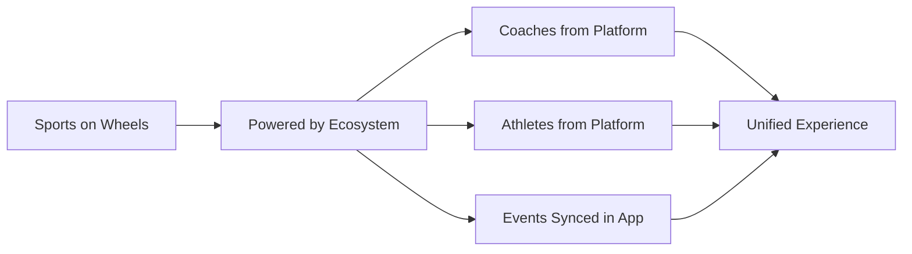

# Sports on Wheels & Vendors Merge Plan

## Executive Summary

This plan outlines the merger of the Sports on Wheels and Vendors pages into a unified, cohesive experience. The goal is to eliminate the disconnected feeling of a separate product and create a bridge to the SocioSports ecosystem while enabling vendors to discover and book stalls at ongoing tournaments and events.

---

## Current State Analysis

### Sports on Wheels Page ([`SportsOnWheelsPage.tsx`](app/src/pages/SportsOnWheelsPage.tsx))
- **Hero Section**: Uses `/images/sports_on_wheels.jpg` - needs replacement
- **Features**: 60-Minute Setup, Elite Equipment, Certified Officials, Safety Guaranteed
- **Activities Portfolio**: Field Sports, Racquet Sports, Fitness & Fun, Traditional
- **Sectors Supported**: Housing Societies, Schools & Colleges, Corporate Parks
- **Event Flow**: 4-step process visualization
- **Safety First Section**: Safety protocols and guarantees
- **Marketplace Section**: Stall options for vendors

### Vendors Page ([`VendorsPage.tsx`](app/src/pages/VendorsPage.tsx))
- **Hero Section**: Partner Gateway messaging
- **Market Reach Section**: Access to captive audience
- **Benefits Grid**: Direct Monetization, Brand Visibility, Verified Audience
- **Stall Categories**: Retail Pop-up, Nutrition Station
- **How to Book**: 4-step process
- **Featured Vendors Directory**: Trusted partners showcase

### Navigation ([`Navigation.tsx`](app/src/sections/Navigation.tsx))
- Both Sports on Wheels and Vendors have separate navigation links (lines 98-99)

---

## Proposed Changes

### 1. Navigation Updates

**File**: [`Navigation.tsx`](app/src/sections/Navigation.tsx)

Remove the separate Vendors link from the navigation:

```typescript
// BEFORE
{ label: 'Sports on Wheels', href: '/sports-on-wheels', icon: Truck },
{ label: 'Vendors', href: '/vendors', icon: Store },

// AFTER
{ label: 'Sports on Wheels', href: '/sports-on-wheels', icon: Truck },
```

### 2. Route Updates

**File**: [`App.tsx`](app/src/App.tsx)

- Remove or redirect the `/vendors` route to `/sports-on-wheels`
- Keep the VendorsPage import for potential future use or redirect

### 3. Sports on Wheels Page Redesign

**File**: [`SportsOnWheelsPage.tsx`](app/src/pages/SportsOnWheelsPage.tsx)

#### 3.1 Hero Section Enhancement
- Replace hero image with premium green-park setup showing:
  - People playing with variety of sports equipment
  - Van with SocioSports logo on it
  - Professional, polished look

#### 3.2 New Bridge Section: Powered by SocioSports Ecosystem

Add after the hero section:

```
┌─────────────────────────────────────────────────────────────────┐
│           POWERED BY SOCIOSPORTS ECOSYSTEM                      │
│                                                                 │
│  ┌─────────────┐  ┌─────────────┐  ┌─────────────┐             │
│  │   COACHES   │  │  ATHLETES   │  │   EVENTS    │             │
│  │    FROM     │  │    FROM     │  │   SYNCED    │             │
│  │  PLATFORM   │  │  PLATFORM   │  │  IN APP     │             │
│  │             │  │             │  │             │             │
│  │ 150+ NIS    │  │ 5000+       │  │ Same events │             │
│  │ Certified   │  │ Verified    │  │ listed in   │             │
│  │ Professionals│  │ Players     │  │ the app     │             │
│  └─────────────┘  └─────────────┘  └─────────────┘             │
│                                                                 │
│  "All interconnected. One platform. Infinite possibilities."   │
└─────────────────────────────────────────────────────────────────┘
```

#### 3.3 Improved Features Section

Update wording for elite equipment and certified officials:

| Current | Improved |
|---------|----------|
| Elite Equipment: International-grade gear for 12+ sports | **Pro-Grade Equipment**: Tournament-standard gear maintained to international specifications, from professional boundary systems to electronic scoring |
| Certified Officials: NIS-certified coaches and international-standard referees | **Expert Officials**: NIS-certified coaches and internationally-accredited referees from our verified platform network |

#### 3.4 Activities Portfolio Enhancement

Add View More functionality:

```typescript
// Add state for showing more activities
const [showAllActivities, setShowAllActivities] = useState(false);

// Display limited activities with View More button
{activities.slice(0, showAllActivities ? activities.length : 4).map(...)}
<button onClick={() => setShowAllActivities(true)}>View More Activities</button>
```

#### 3.5 Vendor Opportunities Section

Add a dedicated section for vendors to:
1. See ongoing tournaments and events
2. Book stalls directly from the page
3. View available spots and pricing

```
┌─────────────────────────────────────────────────────────────────┐
│        VENDOR OPPORTUNITIES AT SPORTS ON WHEELS EVENTS          │
│                                                                 │
│  ┌──────────────────────────────────────────────────────────┐  │
│  │  UPCOMING TOURNAMENTS & EVENTS                            │  │
│  │  ┌────────┐ ┌────────┐ ┌────────┐ ┌────────┐            │  │
│  │  │Event 1 │ │Event 2 │ │Event 3 │ │Event 4 │            │  │
│  │  │Cricket │ │Football│ │Badminton│ │Tennis  │            │  │
│  │  │Feb 20  │ │Feb 25  │ │Mar 1   │ │Mar 5   │            │  │
│  │  │3 stalls│ │5 stalls│ │2 stalls│ │4 stalls│            │  │
│  │  │available│ │available│ │available│ │available│           │  │
│  │  └────────┘ └────────┘ └────────┘ └────────┘            │  │
│  └──────────────────────────────────────────────────────────┘  │
│                                                                 │
│  ┌────────────────────┐  ┌────────────────────┐                │
│  │   RETAIL POP-UP    │  │ NUTRITION STATION  │                │
│  │   10x10 FT Tent    │  │   8x8 FT Booth     │                │
│  │   High Visibility  │  │   Power Included   │                │
│  │   [BOOK NOW]       │  │   [BOOK NOW]       │                │
│  └────────────────────┘  └────────────────────┘                │
└─────────────────────────────────────────────────────────────────┘
```

#### 3.6 Book Now CTA Integration

Add Book Now buttons throughout the page:
- Hero section: Request Deployment
- Activities section: Book for Your Location
- Vendor section: Book Your Stall
- Final CTA: Book an Event

---

## New Section Component: PoweredByEcosystem.tsx

**File**: [`sections/PoweredByEcosystem.tsx`](app/src/sections/PoweredByEcosystem.tsx) (new)



### Component Structure:
1. Section header with ecosystem branding
2. Three-column grid showing:
   - Coaches: NIS-certified from platform
   - Athletes: Verified players from platform
   - Events: Same tournaments listed in app
3. Connection visualization showing interrelation
4. CTA to explore ecosystem

---

## Integration with EventsTournaments

The merged page will include a modified version of the EventsTournaments section specifically for vendors:

```typescript
<EventsTournaments 
  isVendorView={true} 
  title="Upcoming Events for Vendor Booking"
  showBookStallButton={true}
/>
```

This allows vendors to:
1. See all upcoming Sports on Wheels events
2. Check stall availability
3. Book stalls directly

---

## Implementation Order

1. **Phase 1: Navigation & Routing**
   - Update Navigation.tsx to remove Vendors link
   - Update App.tsx to redirect /vendors to /sports-on-wheels

2. **Phase 2: Create New Components**
   - Create PoweredByEcosystem.tsx section
   - Create VendorOpportunities.tsx section

3. **Phase 3: Redesign SportsOnWheelsPage**
   - Replace hero image
   - Add PoweredByEcosystem section
   - Improve feature wording
   - Add View More functionality
   - Integrate vendor opportunities
   - Add Book Now CTAs

4. **Phase 4: Integration**
   - Integrate EventsTournaments for vendor view
   - Update Marketplace section
   - Test booking flows

5. **Phase 5: CMS Updates**
   - Update SportsOnWheelsCms.tsx for new content fields
   - Remove or deprecate VendorsPageCms.tsx

---

## Visual Design Guidelines

### Color Scheme
- Primary: Orange accent (#FF5722)
- Secondary: Navy/Dark backgrounds
- Ecosystem bridge: Gradient from orange to blue

### Typography
- Headings: Bold, uppercase, tracking-tight
- Body: Medium weight, relaxed leading
- CTAs: Black, uppercase, tracking-widest

### Image Requirements
- Hero: Premium green-park setup with van (new image needed)
- Activity cards: High-quality sports imagery
- Vendor stalls: Professional setup photos

---

## Content Updates

### Hero Section
```
BEFORE: "Professional sports infrastructure delivered anywhere. We bring the stadium to you."

AFTER: "Professional sports infrastructure delivered anywhere. Powered by India's largest sports ecosystem. We bring the stadium—and the community—to you."
```

### Features Section
```
BEFORE: 
- Elite Equipment: International-grade gear for 12+ sports
- Certified Officials: NIS-certified coaches and referees

AFTER:
- Pro-Grade Equipment: Tournament-standard gear maintained to international specifications
- Platform Officials: NIS-certified coaches and internationally-accredited referees from our verified network
```

### New Ecosystem Bridge Copy
```
"Every Sports on Wheels event is powered by the SocioSports ecosystem. 
Our coaches come from the platform. Our athletes are verified members. 
Our events are synced across the app. One interconnected network."
```

---

## Success Metrics

1. **User Experience**
   - Reduced confusion about separate vendor product
   - Clear connection to ecosystem
   - Streamlined booking process

2. **Business Goals**
   - Increased vendor stall bookings
   - Higher event participation
   - Better ecosystem awareness

3. **Technical**
   - No broken links or routes
   - All booking flows functional
   - CMS properly updated

---

## Files to Modify

| File | Changes |
|------|---------|
| [`Navigation.tsx`](app/src/sections/Navigation.tsx) | Remove Vendors link |
| [`App.tsx`](app/src/App.tsx) | Redirect /vendors route |
| [`SportsOnWheelsPage.tsx`](app/src/pages/SportsOnWheelsPage.tsx) | Major redesign |
| [`Marketplace.tsx`](app/src/sections/Marketplace.tsx) | Enhance with booking |
| [`SportsOnWheelsCms.tsx`](app/src/pages/admin/content/SportsOnWheelsCms.tsx) | Add new content fields |

## Files to Create

| File | Purpose |
|------|---------|
| [`PoweredByEcosystem.tsx`](app/src/sections/PoweredByEcosystem.tsx) | Ecosystem bridge section |
| [`VendorOpportunities.tsx`](app/src/sections/VendorOpportunities.tsx) | Vendor booking section |

---

## Questions for Client

1. Should we keep the /vendors URL as a redirect, or remove it entirely?
2. Do you have a specific image for the premium green-park hero, or should we source one?
3. Should vendor profiles from the old VendorsPage be migrated to the new unified experience?
4. Are there specific tournaments that should be highlighted for vendor booking?

---

*Plan created: February 2026*
*Status: Ready for Review*
