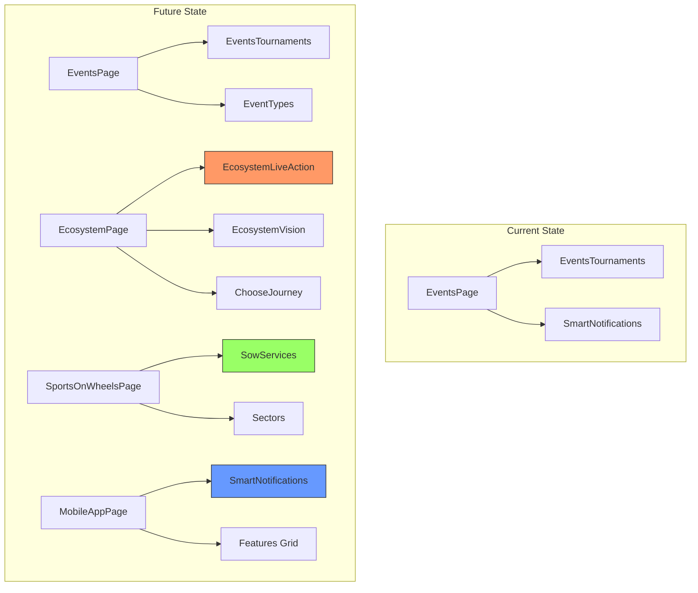

# Tournament Content Reorganization Plan

## Overview
This plan outlines the reorganization of tournament-related content from the EventsPage into more contextually appropriate pages within the SocioSports application.

## Current State Analysis

### Content to be Reorganized

| Section | Current Location | Content Description |
|---------|-----------------|---------------------|
| Live Action - Compete. Conquer. | [`EventsTournaments.tsx`](app/src/sections/EventsTournaments.tsx:18-23) | Hero header for tournaments section |
| Our Services | Not yet created | Service offerings for Sports on Wheels |
| Smart Notifications - STAY INFORMED | [`SmartNotifications.tsx`](app/src/sections/SmartNotifications.tsx:116-118) | Notification features section |

### Target Pages

1. **EcosystemPage** ([`EcosystemPage.tsx`](app/src/pages/EcosystemPage.tsx)) - Will receive Live Action section
2. **SportsOnWheelsPage** ([`SportsOnWheelsPage.tsx`](app/src/pages/SportsOnWheelsPage.tsx)) - Will receive Our Services section
3. **MobileAppPage** ([`MobileAppPage.tsx`](app/src/pages/MobileAppPage.tsx)) - Will receive Smart Notifications section

---

## Detailed Implementation Plan

### Task 1: Create Live Action Section for EcosystemPage

**File to Create:** `app/src/sections/ecosystem/EcosystemLiveAction.tsx`

**Purpose:** Display tournament opportunities available to ecosystem members with a compelling header.

**Content Structure:**
```
Header: "Live Action"
Title: "Compete. Conquer."
Description: "Discover 20+ active tournaments in your city. From district rankings to corporate leagues."
```

**Placement in EcosystemPage:** After `EcosystemVision` section, before `ChooseJourney`

**Key Features:**
- Animated entrance using GSAP
- Tournament stats display
- Call-to-action linking to Events page
- Responsive design matching ecosystem theme

---

### Task 2: Create Our Services Section for SportsOnWheelsPage

**File to Create:** `app/src/sections/SowServices.tsx`

**Purpose:** Showcase the four main service offerings with booking capabilities.

**Service Cards:**

| Service | Features | CTA |
|---------|----------|-----|
| Society Sports Days | Family-centric Games, Badminton & Cricket, Zero Setup Required | Book This Event |
| Corporate Team Building | Inter-Company Leagues, Stress-Buster Games, Awards & Ceremony | Book This Event |
| School Sports Programs | Age-Appropriate Drills, March Past Support, Medal Distribution | Book This Event |
| Mega Carnivals | Multi-Sport Zones, Crowd Management, Sponsorship Ready | Book This Event |

**Design Requirements:**
- Each service card marked as "Expert Managed"
- Booking modal integration using existing `UniversalBookingModal`
- GSAP scroll animations
- Mobile-responsive grid layout

**Placement in SportsOnWheelsPage:** After hero section, before sectors section

---

### Task 3: Move Smart Notifications to MobileAppPage

**Current File:** [`SmartNotifications.tsx`](app/src/sections/SmartNotifications.tsx)

**Changes Required:**
1. Keep the existing component file
2. Remove import from [`EventsPage.tsx`](app/src/pages/EventsPage.tsx:3)
3. Add import to [`MobileAppPage.tsx`](app/src/pages/MobileAppPage.tsx)
4. Place section after the Features Grid section

**Content Preview:**
```
Header: "Smart Notifications"
Title: "STAY INFORMED"
Description: "Never miss opportunities. Get notified about everything that matters to your sports journey."
```

**Notification Types:**
- New tournaments in your area
- Registration opening soon
- Deadlines approaching
- Coach availability in your slot
- Scout is viewing your profile
- Event starting tomorrow

---

## File Changes Summary

### New Files to Create
| File | Purpose |
|------|---------|
| `app/src/sections/ecosystem/EcosystemLiveAction.tsx` | Live Action section for EcosystemPage |
| `app/src/sections/SowServices.tsx` | Our Services section for SportsOnWheelsPage |

### Files to Modify
| File | Changes |
|------|---------|
| `app/src/pages/EcosystemPage.tsx` | Import and add EcosystemLiveAction section |
| `app/src/pages/SportsOnWheelsPage.tsx` | Import and add SowServices section |
| `app/src/pages/MobileAppPage.tsx` | Import and add SmartNotifications section |
| `app/src/pages/EventsPage.tsx` | Remove SmartNotifications import and usage |

---

## Architecture Diagram



---

## Implementation Order

1. **Create EcosystemLiveAction.tsx** - New section component
2. **Create SowServices.tsx** - New section component with booking integration
3. **Update EventsPage.tsx** - Remove SmartNotifications
4. **Update EcosystemPage.tsx** - Add EcosystemLiveAction
5. **Update SportsOnWheelsPage.tsx** - Add SowServices
6. **Update MobileAppPage.tsx** - Add SmartNotifications

---

## Technical Considerations

### GSAP Animations
- All new sections should use GSAP with ScrollTrigger
- Follow existing animation patterns in the codebase
- Use `gsap.context` for proper cleanup

### Booking Integration
- SowServices should use the existing `UniversalBookingModal` component
- Pass appropriate mode parameter for different service types

### CMS Support
- Both new sections should support dynamic content from CMS
- Use the existing `api.cms.get()` pattern for content fetching

### Responsive Design
- Mobile-first approach
- Use Tailwind CSS classes consistent with existing sections
- Test on multiple viewport sizes

---

## Acceptance Criteria

- [ ] Live Action section displays correctly on EcosystemPage
- [ ] Our Services section shows all 4 service cards with booking functionality
- [ ] Smart Notifications section appears on MobileAppPage
- [ ] EventsPage still functions correctly without SmartNotifications
- [ ] All animations work as expected
- [ ] Mobile responsive design verified
- [ ] No console errors or warnings
